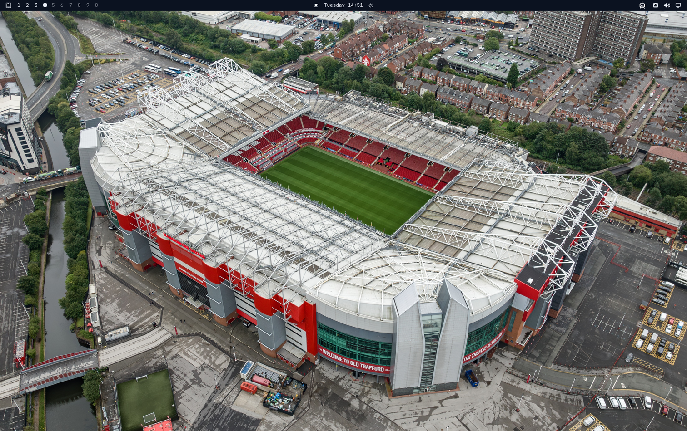
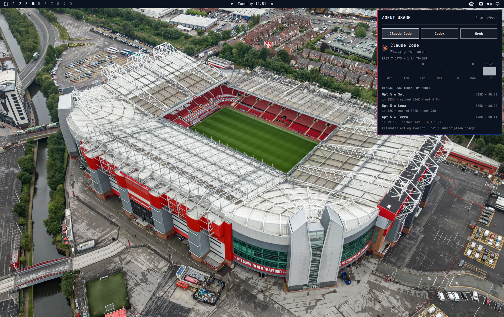

# Anuj Omarchy AI Usage Tracker

An Omarchy bar plugin with one neutral AI icon and tabbed Claude, Codex, and Grok usage.

## Screenshots

Clean captures from display 0:





## What it shows

The bar shows a single neutral AI icon. Open it for provider tabs, weekly allowance, reset countdowns, token usage, and API-equivalent estimates:

```text
Claude | Codex | Grok
```

A provider turns red when its usage exceeds the prorated portion of its seven-day window. For example, with 70% of the week elapsed, 76% used is behind pace while 58% used is ahead.

Click the bar display for detailed meters, expected remaining allowance, pace difference, a seven-day token chart, and additional limit windows. Right-click or middle-click to refresh immediately.

The installed local version also shows Codex **tokens by model** with input,
cached, and output totals. It includes an **API-equivalent cost estimate** for
known models using current USD per-million-token reference rates. This is an
estimate only: ChatGPT/Codex subscription usage is not the same as an API bill,
and unknown model IDs are shown as `n/a`.

## Requirements

- Omarchy with Quickshell plugin support.
- Authenticated Claude Code and Codex CLIs.
- Omarchy's `omarchy-agent-usage-claude` and `omarchy-agent-usage-codex` collectors.

The plugin runs each collector with `--limits-only`. It uses the credentials already managed by the provider CLIs and does not read or store credentials.

## Installation

```bash
omarchy plugin add https://github.com/anujraja/anuj-omarchy-ai-usage-tracker.git --enable
```

For a local checkout:

```bash
omarchy plugin add ~/code/anuj-omarchy-ai-usage-tracker --enable
```

Disable Omarchy's built-in Agents display if both widgets appear:

```bash
omarchy plugin disable omarchy.agents
```

## Usage

- Left-click the bar display to open or close details.
- Right-click or middle-click to refresh.
- Press `R` while the panel is open to refresh.
- Press Escape to close the panel.

The plugin refreshes every five minutes by default. Change the interval with:

```bash
omarchy bar set anuj-omarchy-ai-usage-tracker refreshIntervalSec 600 --json
```

## Removal

Remove the plugin with:

```bash
omarchy plugin remove anuj-omarchy-ai-usage-tracker
```

Restore Omarchy's built-in Agents display if desired:

```bash
omarchy plugin enable omarchy.agents
```

## License

MIT
