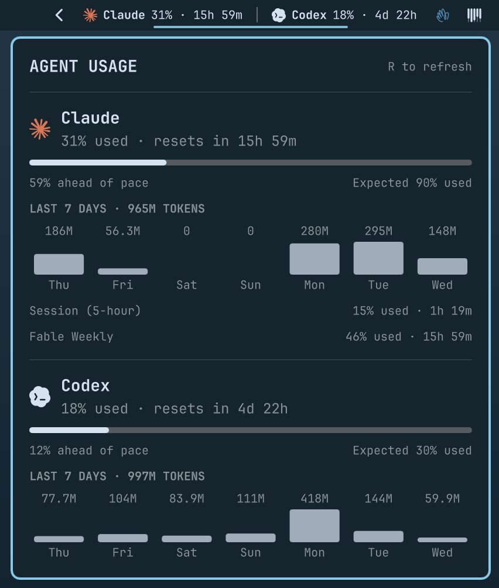

# Agent Usage for Omarchy

An Omarchy bar plugin that keeps weekly Claude and Codex usage visible without opening a panel.



## What it shows

Each provider displays its weekly allowance used and the time until reset directly in the bar:

```text
Claude 31% · 16h  Codex 18% · 4d 22h
```

A provider turns red when its usage exceeds the prorated portion of its seven-day window. For example, with 70% of the week elapsed, 76% used is behind pace while 58% used is ahead.

Click the bar display for detailed meters, expected remaining allowance, pace difference, a seven-day token chart, and additional limit windows. Right-click or middle-click to refresh immediately.

## Requirements

- Omarchy with Quickshell plugin support.
- Authenticated Claude Code and Codex CLIs.
- Omarchy's `omarchy-agent-usage-claude` and `omarchy-agent-usage-codex` collectors.

The plugin runs each collector with `--limits-only`. It uses the credentials already managed by the provider CLIs and does not read or store credentials.

## Installation

```bash
omarchy plugin add https://github.com/robzolkos/omarchy-agent-usage.git --enable
```

For a local checkout:

```bash
omarchy plugin add ~/code/robzolkos/omarchy-agent-usage --enable
```

Disable Omarchy's built-in Agents display if both widgets appear:

```bash
omarchy plugin disable omarchy.agents
```

## Usage

- Left-click the bar display to open or close details.
- Right-click or middle-click to refresh.
- Press `R` while the panel is open to refresh.
- Press Escape to close the panel.

The plugin refreshes every five minutes by default. Change the interval with:

```bash
omarchy bar set robzolkos.agent-usage refreshIntervalSec 600 --json
```

## License

MIT
